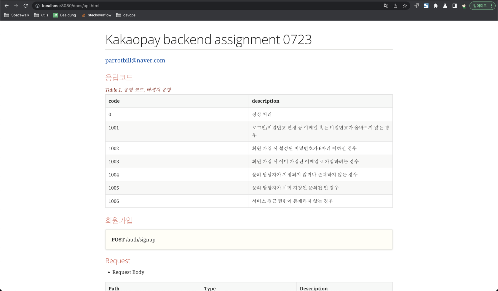
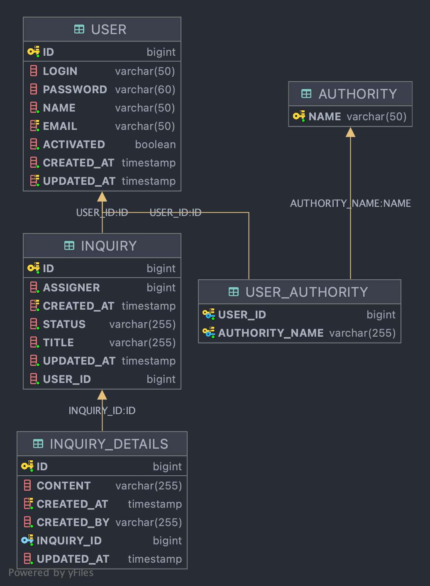

# 과제 kakaopay-backend 2022 
### yieon(parrotbill@naver.com)

---

### 개발 환경
field| stack |
|---|---|
|language | kotlin (java 11) |
|framework | spring-boot 2.3.2.RELEASE|
|DB | H2-mem|
|build tool | gradle
|persistence | JPA, querydsl |
|API doc | ascii |
|etc | log4j 2.17.2 |
|IDE | intellij


### get started
```
./gradlew build
./gradlew
```

### H2 database connect
```
host: localhost
port: 9092
database: mem
user: sa
password: sa1!
url: jdbc:h2:tcp://localhost:9092/mem:testdb
```

### asciidoc
```
./gradlew asciidoctor build
```

### API Document
http://localhost:8080/docs/api.html
- preview
 

### UML


### 문제 해결 전략
- polling
  - interval 사용을 통한 api refresh 보다는 websocket을 통한 실시간 데이터 통신이 더 효과적일 수 있습니다.
  - websocket이 정상적으로 동작하지 않을 때의 safe code가 더해지면 좋은 방향이 될 것 같습니다.
- h2db
  - in-memory db를 사용하면서 H2ServerConfig를 생성하였습니다.
  - postgres 등 효율적인 DB환경 (ex. RDS)에서 운영하기 위한 DataSourceConfig를 새로 구성할 필요가 있습니다.
- reply createdBy(고객문의 by 내용 추가 시 고객의 경우 작성자 고정)
  - 고객이 문의 상세정보 페이지에서 추가 글을 작성했을 때, 작성자를 받고있지 않습니다. 그로 인한 고정 USER token의 name으로 createdBy(작성자)가 저장됩니다.
    - 목록 및 타이틀에 문의 작성 시 입력했던 이름이 표시되기에 큰 의미는 없을 수 있습니다.
    - jwt에 project 항목을 추가 했습니다. 유출된다면 의미없겠지만 1차적인 보안 요소로써 작용 할 수 있다 생각했습니다. 그래서 user에도 고정 token을 발급하여 사용하도록 하였습니다.
    - 이 후 설계 방향에 따라 (고객 token 없이도 요청 가능 or 고객 회원가입 프로세스 추가) 여러 대안을 고려해 볼 수 있을 것 같습니다.
- 총평
  - 다소 길지않은 시간 내에 과제를 진행하면서 최대한 간결하게 작성하고자 하였습니다.
  - 시간적 요소가 보다 충분했다면, 더욱 다양한 것들을 구현해 볼 수 있었을 것 같습니다.
    - 과제에 충실한 기본적인 기능 위주로 개발하였고, WebSocketConfig등을 사용한 Authorization 검증을 거친 브라우저와의 실시간 데이터 통신 기능을 구현하지 못한 것과 좀 더 효율적인 기능을 위한 고민이 상대적으로 적었던 것 같아 아쉬웠습니다.
    - 하지만 뜻깊은 경험이었고 개발을 진행하면서 많은 것들을 배울 수 있는 기회가 되었다 생각합니다.
